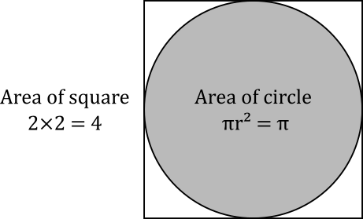
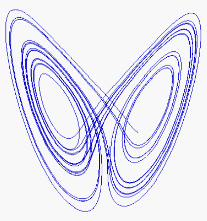
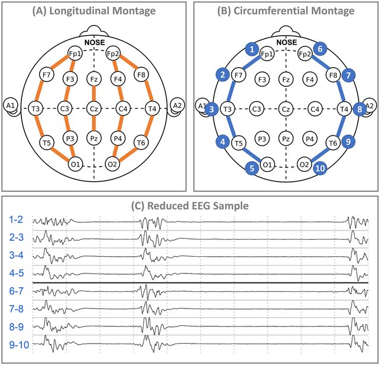

### Adding a default constructor

In a previous exercise, we had set up a simple class to hold student records. Add a default constructor to this class.

**[Click here to access the initial project files](../../../../tree/main/examples/4B/student_class)**

*[🔍 check your answer](../../../../tree/4B_student_default_constructor/examples/4B/student_class) (or check the [diff](../../../../commit/4B_student_default_constructor))*

<br>


### Adding a parameterised constructor

Add a parameterised constructor to your `Student` class, allowing the name, date of birth, and ID to be specified. The GPA should be initialised to zero.

*[🔍 check your answer](../../../../tree/4B_student_parameterised_constructor/examples/4B/student_class) (or check the [diff](../../../../commit/4B_student_parameterised_constructor))*

<br>


### Overloading the constructor

Add an additional parameterised constructor to your `Student` class, which should allow the same attributes to be set as the existing one, but additionally allows the marks for the first module to be provided. These marks will be used to fill in the first entry in the module marks vector.

*[🔍 check your answer](../../../../tree/4B_student_parameterised_constructor2/examples/4B/student_class) (or check the [diff](../../../../commit/4B_student_parameterised_constructor2))*

<br>


### Adding constructor with default arguments

The university also needs to keep track of their student's visa status, which can be one of: home, international, or visitor. Add an attribute to represent the student's visa status to your `Student` class, and provide a method to access this information. Modify your parameterised constructors to accept an additional argument to specify the student's visa status, which should default to 'home'. 

*[🔍 check your answer](../../../../tree/4B_student_constructor_with_default_argument/examples/4B/student_class) (or check the [diff](../../../../commit/4B_student_constructor_with_default_argument))*

<br>


### Adding constructors

Create a new program, and declare a new class called `TestClass`. Your class should have two attributes: an `int` called `m_value` and a `std::string` called `m_label`. Add the following to your class:
- a default constructor to initialised these values, and additionally print to terminal that the object has been created (along with the values it was initialised with);
- a parameterised constructor to allow the user to provide these values, which will also print to terminal that the object has been created and the values it was set to;
- a copy constructor, which will also print to terminal that the object has been copied, and the values that it is now set to;

In your program's `main()` function, add statements to create objects of your class, constructed using these different constructors, and verify that these calls all work as expected.

*[🔍 check your answer](../../../../blob/4B_test_class_constructors/examples/4B/test_class/main.cpp)*

<br>


### Adding a destructor

Modify your earlier `TestClass` example by adding a destructor, which will also print to terminal that the object is being destroyed, and the values that it had been set to.

*[🔍 check your answer](../../../../blob/4B_test_class_destructor/examples/4B/test_class/main.cpp) (or check the [diff](../../../../commit/4B_test_class_destructor))*

<br>


### Finalising actions in the class destructor: adding a progress meter to long-running processes

One way to compute the value of *π* is to sample a square, and count how many samples fall within the circle as a proportion of the total number of samples. This provides an estimate of the ratio of the area of the unit circle (*π*) relative to the area of the square (4), allowing us to obtain an estimate of π as 4×(fraction in circle).



A program has been written to estimate the value of π using this procedure. It contains a function that iterates over a grid on the unit square, and computes the number of (x,y) samples that fall within the circle (x²+y²<1). The function takes a single argument, corresponding to the number of grid samples along each axis (so a value a 1000 means there will be a total of 1000×1000 samples), and returns a floating-point value corresponding to the estimated fraction. 

**[Click here to access the initial project files](../../../../tree/main/examples/4B/progress_meter)**

You will notice that the program can take some time to iterate over all the samples for large grid sizes, and can therefore appear to have stalled. To ensure users don't think the program has crashed, it is helpful to provide a *progress meter*.

Add a class to your project, called `ProgressBar`, whose purpose is to provide the current progress status to the user, as a percentage of the task. The idea is to specify how many 'items' of work need to be processed when initialising the progress meter, and progressively increment the count of completed 'items' during processing. During the incremental update, the task completion is computed as a percentage and displayed on the terminal.
- The class should have a single parameterised constructor, taking a text message to display while reporting the progress, and a maximum integer count, representing the total amount of work to be done in the task. 
- The class should have a method called `inc()` whose job is to increment the amount of work done so far by one and update the progress report accordingly. This should compute the percentage completed so far (100 × current count divided by max count), and write an appropriately formatted update to `std::cerr`, which should look something like (assuming the text provided to the constructor was 'sampling unit circle'):
  ```
  [ 19%] sampling unit circle...
  ```
  To ensure updates don't keep flooding the terminal, the display should overwrite the previous message. This can be done by printing the *carriage return* special character (`\r`) as the first character (which brings the cursor to the start of the line), and not using a newline at the end to stay on the same line.
- The class should have a destructor whose job is to print the final message, this time terminated with a newline character to ensure subsequent writes to the terminal start on the next line, as expected. This message could look something like:
  ```
  [done] sampling unit circle...
  ```

Use your new `ProgressBar` class in the `fraction_in_circle()` function, constructing an instance of your `ProgressBar` with suitable parameters, and invoking its `inc()` method at suitable intervals in the iterations. Compile and test your program with larger values of the grid size to verify its operation.

*[🔍 check your answer](../../../../tree/4B_progress_meter/examples/4B/progress_meter/) (or check the [diff](../../../../commit/4B_progress_meter))*

<br>


### Adding a copy assignment operator

Modify your earlier `TestClass` example by adding a copy assignment operator, which will also print to terminal that the object is being copied, reporting the values that it has now been set to.

*[🔍 check your answer](../../../../blob/4B_test_class_copy_assignment/examples/4B/test_class/main.cpp) (or check the [diff](../../../../commit/4B_test_class_copy_assignment))*

<br>


### Defining special functions outside class declaration

Modify your earlier Student class to define all constructors in the `student.cpp` file. 

*[🔍 check your answer](../../../../tree/4B_student_separate_definition/examples/4B/student_class/) (or check the [diff](../../../../commit/4B_student_separate_definition))*

<br>


### Using the this pointer to design fluent interface: the Lorenz attractor

The [Lorenz attractor](https://en.wikipedia.org/wiki/Lorenz_system) is a well-known system of 3 ordinary differential equations that exhibit chaotic behaviour. The path of a 3D point is driven by the following equations:

$$ \frac{dx}{dt} = \sigma (y-x) $$
$$ \frac{dy}{dt} = x (\rho-z)-y $$
$$ \frac{dz}{dt} = xy - \beta z $$

where $\sigma$, $\rho$ and $\beta$ are parameters typically set to the values 10, 28 and 8/3 respectively.

This can be simulated by using a predefined small time step $\delta t$, and computing the next position based on the computed velocities computed above:

$$x_{n+1} = x_n + \delta t \times \frac{dx}{dt} $$
$$y_{n+1} = y_n + \delta t \times \frac{dy}{dt} $$
$$z_{n+1} = z_n + \delta t \times \frac{dz}{dt} $$

Write a class to simulate the Lorenz Attractor. Your class should have private attributes to hold all the parameters ($\sigma$, $\rho$, $\beta$, $\delta t$ and the initial position), and methods to:
- set the initial {x,y,z} position
- set the 3 parameters $\sigma$, $\rho$ and $\beta$
- set the time interval $\delta t$
- run the simulation for the number of time steps specified as an argument, recording and returning the {x,y,z} positions at each time step in a suitable data structure.

Your methods (other than the final simulate method) should return a reference to their object (using the `this` pointer), to allow these methods to be called on the output of another methods, thereby providing a [fluent interface](https://en.wikipedia.org/wiki/Fluent_interface).

Make use of your class in your `main()` function, and plot the positions as a 2D plot as a projection in the x-z plane using the terminal graphics library. Your plot should look like this:



*[🔍 check your answer](../../../../blob/4B_lorenz_attractor/examples/4B/lorenz_attractor/main.cpp)*

<br>


## OOP design: patient database report generation

We need to design a program to read patient data from a local database, select patients based on user-specified criteria, and produce a PDF report suitable for viewing. 

When designing the program, there are additional issues to consider:
- Due to strategic decisions outside our control, we may need to switch to a different types of databases in future.
- The format of the report may be a PDF for now, but we may wish to switch to HTML, Excel, or some other format in future.
- Initially, our program will allow simple queries to be run to select patients, based on current requirements - but these requirements are likely to grow over time. 

Suggest a suitable OOP design that would be appropriate for this program. 

*[🔍 check your answer](../../../../blob/4B_OOP_design/examples/4B/patient_database.md)*

<br>


### OOP design: EEG processing and display system

We need to design software to process and display electroencephalogram (EEG) data. EEG data consist of 21 simultaneous recordings of the electrical activity measured using electrodes placed at standard layout on the scalp, with a sampling rate of 250 Hz. However, the number of electrodes can go up to 256 on high-density EEG systems, and the sampling rate go also be higher on high-end systems. 

Electrical activity is typically displayed as a *montage*, consisting of a standard arrangement of electrode pairs, which involves showing the potential difference between known pairs of electrodes. This is illustrated in the figure below. 

<br>
[*Image from Westover et al., Neurocritical Care 33: 479–490 (2020)*](https://doi.org/10.1007/s12028-019-00911-4)

There are many different types of these montages in common use, and our system needs to be able to handle any such scheme, which means computing the expected signal differences and displaying them accordingly. 

Our system also need to be able to process each signal using our standard noise reduction algorithm.

When designing the program, there are additional issues to consider:
- The data are being recorded directly from the EEG recording system, using the appropriate hardware interface, but it is likely that we may need to modify the software to handle other systems in the future.
- Our noise reduction algorithm may be modified or replaced in the future.
- Our system should be capable of handling all standard and any future montages.

Suggest a suitable OOP design that would be appropriate for this program. 

*[🔍 check your answer](../../../../blob/4B_OOP_design/examples/4B/eeg_montage.md)*

<br>
